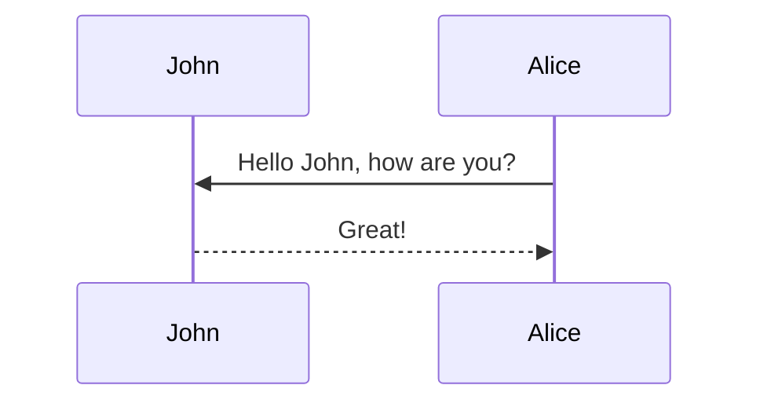

## Introduction
Large language models (LLMs) have improved dramatically in recent years, largely by scaling their capacity and the quantity of training data (Kaplan et al., 2020; OpenAI, 2025; DeepMind,
2025; Anthropic, 2025; Grattafiori et al., 2024). For instance, training the Llama 3.1 405B model required more than 1025 FLOPs and utilized up to 16,000 H100 GPUs (Grattafiori
et al., 2024). Scaling these models involves not only the initial, compute-intensive pretraining
phase but also frequent retraining as new data, algorithms, or architectures emerge, as well
as post-training protocols that prepare the model for inference/deployment.
To reduce these computational burdens, recent hardware advancements have introduced
native support for lower-precision computations, such as FP8 training in NVIDIA H100
GPUs (Micikevicius et al., 2022b; Noune et al., 2022). Hardware accelerators powered by
NVIDIA’s Blackwell architecture further extend these capabilities with standardized, sharedscale Microscaling (MX) formats like MXFP8 and MXFP6 (NVIDIA, 2025). These formats
store a per-block shared scale, which expands the effective dynamic range with minimal
memory overhead, while simultaneously enabling GEMMs at lower precision (Rouhani et al.,
2023; Darvish Rouhani et al., 2023b). While pretraining is typically done in 16 or 32-bit
precision, some quantization schemes are already seeing industry adoption; for example,
DeepSeek-V3 employs tile-wise FP8 quantization within large tensors (Liu et al., 2024), while
Cohere’s Command A model was trained in FP8 while reserving higher-precision operations
for activation functions and attention mechanisms (Cohere et al., 2025). At an even larger scale, the Llama-4 series of models is reported to have been pretrained in FP8 precision
across nearly 32,000 GPUs (Meta, 2025). On the deployment side, methods like QAT and
mixed-precision fine-tuning further underscore the importance of understanding low-precision
training dynamics (Jacob et al., 2017; Abdolrashidi et al., 2021; Shao et al., 2024).
Two primary challenges accompany the adoption of low-precision formats for training. First,
there is a potential performance tradeoff, where reducing precision may result in degradation
of loss and downstream accuracy, which can be characterized through scaling laws that account
for both compute and precision (Kumar et al., 2024). Second, instabilities during training can
occur, often manifesting as abrupt spikes in the loss curve that disrupt convergence (Fishman
et al., 2024; Lee et al., 2025). When these instabilities push optimization into regions from
which recovery is impossible, they obstruct our ability to extract valid scaling laws, making
it impossible to even assess the tradeoffs introduced by low-precision training.
In this work, we set out to understand the training dynamics of low-precision MX precision
formats to identify format prescriptions for language model training on next-generation
hardware. However, like prior observations on (albeit non-MX) low-precision training
by Fishman et al. (2024); Lee et al. (2025), we found that training frequently became
unstable, particularly for larger, compute-intensive models. The instabilities are pervasive,
emerging across a broad range of activation functions, model scales, quantization formats,
and hyperparameter settings.
Because large-scale language model (LM) sweeps are computationally intensive and involve
many entangled components, we turn to a controlled synthetic setting to understand the
origin of these instabilities. Specifically, we present a residual multi-layer perceptron (MLP)
model that captures key architectural components of the LM, and allows us to identify
conditions under which training becomes unstable. In particular, we are able to perform
hyperparamter sweeps, ablations across MX configurations, quantization schemes (e.g.,
forward-only vs. full quantization), and activation functions, and analyze their effects on
stability.
Our findings support a phenomenological explanation in which training instabilities primarily
arise from systematic bias in gradient estimates introduced by quantization. We find that the
primary contribution to this bias is the quantization of the layer normalization (layernorm)
affine weights, whose values often become tightly clustered over the course of training. When
the values within a block converge too closely, division by the shared block scale can clamp
all values in that block to the largest representable number, destabilizing training. We verify
that this mechanism is not limited to synthetic settings but also emerges in the LM setting
by evaluating mitigation strategies to stabilize LM training, including disabling layernorm
quantization and using high precision in selective parts of the network computation.


<!-- $$
\left( \sum_{k=1}^n a_k b_k \right)^2 \leq \left( \sum_{k=1}^n a_k^2 \right) \left( \sum_{k=1}^n b_k^2 \right)
$$ -->


[on par with KaTeX](http://www.intmath.com/cg5/katex-mathjax-comparison.php).

## Related Work

### Low-Precision Instabilities


### Review of MX Formats and Experimental Approach


## LLM Experiments
### Setup

### Instabilities in Low Precision


## Synthetic Experiments

### Setup


### The Effect of Activation Functions and layernorms


## Overflow Dynamics


### Overflow Issues with layernorms


### Potential Mitigations
To clearly establish causality of which components can (de)stabilize training, we ask whether
an impending divergence can be averted by in-situ interventions to the training recipe. 
Figure 4 tracks a configuration that is stable in FP32 but diverges in MXFP8 E4M3. This
setting corresponds to the previously described student-teacher scenario with four layers and
model dimension dmodel = 512. The instability starts approximately at step 5090 and we
consider interventions just before the instability, at step 5080, and well before the instability,
at step 4500. For each intervention we keep the random seed, model state, and batch sequence
identical, so the training state at the intervention step is the same as in the baseline run, so
any divergence afterward is therefore solely attributable to the intervention.


Key Takewaways The dominant MX precision-specific bias comes from overflow of
clustered layer-norm affine weights (and a small fraction of activations). Our intervention
experiments show that raising precision in key parts of the computation, such as increasing
the precision of layer norms or activations, can greatly improve stability.


##  Stabilization Strategies in LM Setting
Motivated by the effective mitigations observed in our synthetic experiments, we return
to the language-model (OLMo) setting and consider two training strategies: (1) retaining
bfloat16 as the element format for activations and layer norms, and (2) applying MX
quantization only to the forward pass. We emphasize that these are diagnostic and not
production-ready mitigations. Keeping activations in bfloat16 generally yields no computethroughput gain on hardware where the MMA executes in bfloat16, because mixed-operand
kernels typically upcast the lower-precision operand to the MMA precision. Conversely,
downcasting activations to low precision during the matmul would reintroduce the very
instabilities we aim to avoid. We defer a more fine-grained study of which layers truly require
high-precision activations to future work. Likewise, quantizing only the forward pass can at
most accelerate the forward fraction of training. Under standard assumptions, the backward
step costs roughly twice the forward, so the idealized wall-clock speedup is capped near
∼33%.

In both cases, we find that training remains stable across all FP8 configurations. Table 1
reports validation loss differences relative to full-bfloat16 baselines. MXFP8 E4M3 weights
paired with bfloat16 activations in particular match full-precision performance across all
tested model sizes. In Appendix G, we study how these results scale with compute and fit
valid Chinchilla-style scaling laws. Full loss curves and scaling law fits for both mitigation
strategies compared to bfloat16 baselines are also provided in Appendix G.


## Conclusion
We showed that training LLMs in shared-scale/MX configurations can lead to sharp, unrecoverable instabilities. Using large-scale LLM sweeps and a simple proxy model trained
on synthetic data, we isolate a failure mode of quantization-induced gradient bias, where
shared-scale clamping (particularly of layer-norm affine weights and to a lesser extent, other
activations) injects gradient noise that ultimately destabilizes training. We evaluated several
diagnostic mitigations, and found that stability can be preserved using higher precision in
selective parts of the network computation.
Looking ahead, continued hardware advances will expand the frontier of what is computationally feasible. Some concrete directions include: extending our proxy model to include
mixture-of-experts with many layers, and other transformer-specific components to better
predict instabilities; developing a clear theoretical picture of instabilities in optimization (see
Appendix B); and designing new blockwise scaling schemes such as in Mishra et al. (2025)
that adapt to skewed or tightly clustered distributions.


<!-- ```markdown

``` -->





<!-- <div class="row mt-3">
    <div class="col-sm mt-3 mt-md-0">
        
    </div>
    <div class="col-sm mt-3 mt-md-0">
        
    </div>
</div>
<div class="caption">
    A simple, elegant caption looks good between image rows, after each row, or doesn't have to be there at all.
</div>

<div class="row mt-3">
    <div class="col-sm mt-3 mt-md-0">
        
    </div>
    <div class="col-sm mt-3 mt-md-0">
        
    </div>
</div>

<div class="row mt-3">
    <div class="col-sm mt-3 mt-md-0">
        
    </div>
    <div class="col-sm mt-3 mt-md-0">
        
    </div>
    <div class="col-sm mt-3 mt-md-0">
        
    </div>
</div> -->


(**no extra javascript is allowed!**)

```markdown

```


```python
import pandas as pd
import plotly.express as px

fig = px.density_mapbox(
    df, lat='Latitude', lon='Longitude', z='Magnitude', radius=10,
    center=dict(lat=0, lon=180), zoom=0, mapbox_style="stamen-terrain")
fig.show()

fig.write_html('./assets/html/2026-04-27-distill-example/plotly_demo_1.html')
```


```html

<div class="l-page">
  <iframe
    src="{{ 'assets/html/2026-04-27-distill-example/plotly_demo_1.html' | relative_url }}"
    frameborder="0"
    scrolling="no"
    height="600px"
    width="100%"
  ></iframe>
</div>

```


<div class="l-page">
  <iframe src="{{ 'assets/html/2026-04-27-distill-example/plotly_demo_1.html' | relative_url }}" frameborder='0' scrolling='no' height="600px" width="100%"></iframe>
</div>

<d-cite key="gregor2015draw"></d-cite> 


<d-footnote></d-footnote>

##



 <br/> coe <br/> 


 `linenos` 



int main(int argc, char ct \*argv[])
{

    cout << "input a string: ";
    getline(cin, myString);
    int length = myString.length();

    char charArray = new char * [length];

    charArray = myString;
    for(int i = 0; i < length; ++i){
        cout << charArray[i] << " ";
    }

    return 0;

}



 [mermaid.js](https://mermaid-js.github.io/mermaid/){:target="\_blank"} directly.
 [mermaid](https://mermaid-js.github.io/mermaid/){:target="\_blank"} syntax.


```yaml
mermaid:
  enabled: true
  zoomable: true # optional, for zoomable diagrams
```


````

````





<blockquote>
</blockquote>


 `d-article` 

<div class="fake-img l-body">
  <p>.l-body</p>
</div>

 try `.l-page`:

<div class="fake-img l-page">
  <p>.l-page</p>
</div>

<div class="fake-img l-body-outset">
  <p>.l-body-outset</p>
</div>

<div class="fake-img l-page-outset">
  <p>.l-page-outset</p>
</div>

 `.l-screen`.

<div class="fake-img l-screen">
  <p>.l-screen</p>
</div>
<div class="fake-img l-screen-inset">
  <p>.l-screen-inset</p>
</div>

`.l-body`

<div class="fake-img l-gutter">
  <p>.l-gutter</p>
</div>

---


 _asterisks_ (`*asterisks*`) or _underscores_ (`_underscores_`).

 **asterisks** or **underscores**.

 **asterisks and _underscores_**.


1. 
2. 

- 

1. 
   1. 
2. 
  

- 

* 

- 


<!-- [](https://www.google.com "Google's Homepage") -->

[I'm a relative reference to a repository file](../blob/master/LICENSE)

[You can use numbers for reference-style link definitions][1]


[arbitrary case-insensitive reference text]: https://www.mozilla.org
[1]: http://slashdot.org
[link text itself]: http://www.reddit.com


Reference-style:
![alt text][logo]

[logo]: https://github.com/adam-p/markdown-here/raw/master/src/common/images/icon48.png "Logo Title Text 2"

Inline `code` has `back-ticks around` it.

```javascript
var s = "JavaScript syntax highlighting";
alert(s);
```

```
<b>tag</b>.
```


| Tables        |      Are      |  Cool |
| ------------- | :-----------: | ----: |
| col 3 is      | right-aligned | $1600 |
| col 2 is      |   centered    |   $12 |
| zebra stripes |   are neat    |    $1 |


| Markdown | Less      | Pretty     |
| -------- | --------- | ---------- |
| _Still_  | `renders` | **nicely** |
| 1        | 2         | 3          |


> you can _put_ **Markdown** 


